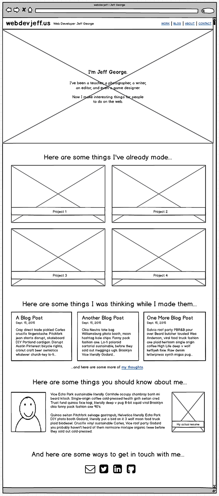
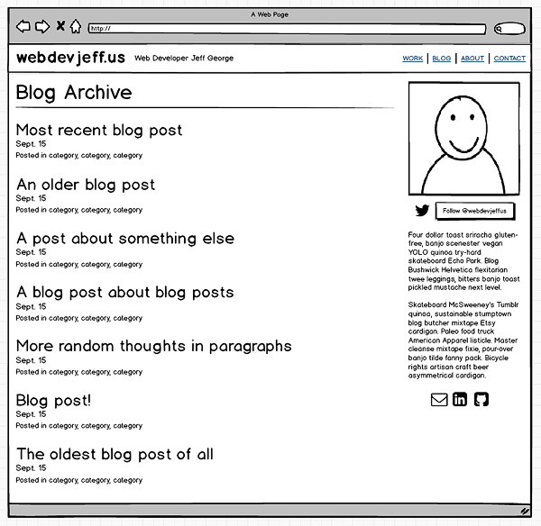

# Wireframe Reflection
### By Jeff George, 9.17.15, for DBC Phase 0

## Index Wireframe for webdevjeffus

## Blog Index Wireframe for webdevjeffus

## Reflection Questions

#### What is a wireframe?

A wireframe is a mock-up of a web page that shows the rough layout of all elements on the page in their intended positions as simple, outlined shapes. The wireframe precedes the design, and generally does not indicate color or font choices, or image selections. Wireframes may be created with general drawing software, such as Illustrator, purpose-built apps, like Balsamiq or Mockingbird, or simply drawn with paper and pencil.

#### What are the benefits of wireframing?

Wireframing lets the development team agree on the arrangment and relative importance of all components of the website prior to committing any decisions to code. Once all stakeholders have signed off on the wireframes, their existence allows the designer and developer to work in parallel rather than in sequence. Working from the wireframe, the developer can begin preliminary coding on the site while the designer refines the site's aesthetic.

#### Did you enjoy wireframing your site?

Once I settled on a tool - the free trial of Balsamiq -- I did enjoy wireframing my site. I was able to prioritize the content and arrange it on the pages without being distracted by design decisions like color, border style, or font selection. Previously, I had only drawn the very roughest ball-point-on-napkin sketches of web pages before jumping into the editor and browser and cranking code. Working in that manner, my coding was frequently road-blocked by design concerns, sending me off for hours tweaking a color palette or switching out fonts when I should have been writing HTML.

#### Did you revise your wireframe or stick with your first idea?

I didn't _toss out_ entire versions of my wireframe, but I certainly revised and tweaked it from the original concept along the way. I had a rough idea of where I was going when I started, but I definitely made changes while I worked that improved the overall layout, and that I think will improve the user's experience once the site is live.

#### What questions did you ask during this challenge? What resources did you find to help you answer them?

I wondered what good developer websites looked like -- how they were laid out, what did they include and where did they put it, etc. I spent some time Googling for "great developer websites," and quickly found links to award winning sites and 10-best lists from the major online web-dev resources. I looked at a dozen or more good web dev portfoliio sites before wireframing my own.

#### Which parts of the challenge did you enjoy and which parts did you find tedious?

Apart from the actual wireframing work, the most enjoyable task was looking closely at the portfolio sites of several top-level designer/developers. I found their sites both intimidating and inspiring, but I was able to notice some general trends that I could apply to my own site.

Tedious isn't quite the right word, but I'd say the part of the challenge that made me the most anxious was picking out a wireframing tool to work with. I was overwhelmed by the number of choices, and then very disappointed with the functionality and friendliness of the free tools. I eliminated several tools because they are run on a monthly-subscription model, and I don't want to get used to using something that's going to suck money out of me every month. In the end, I went with a free trial of Balsamiq, which seems to be the go-to wireframer. It's a bit expensive, at $90, but having used a few of the free ones, and worked for an our or two with Balsamiq, I can attest that you definitely get what you pay for. I expect I'll be paying for Balsamiq along with Sublime very soon.

