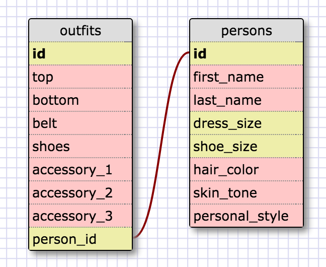

# Challenge 8.4: Introduction to Database Schemas and SCL
#### By Jeff George, 10/28/15,<br>for Dev Bootcamp Phase 0

_Useful docs for the sqlite command-line interface used in this challenge:_
https://www.sqlite.org/cli.html
<br>

## Release 5. SELECTing data from a database
_**NOTE:** To reduce scrolling to some degree, I have deleted most of the results for queries returning all 51 states and territories. The missing records are indicated by an ellipsis (...)._
<br>

#### 1. Select all data for all states.
```SQL
sqlite> .mode column
sqlite> .header on
sqlite> .width 3 16
sqlite> SELECT *
   ...> FROM regions;
id   state_name        population_density  population  region_id
---  ----------------  ------------------  ----------  ----------
1    Alabama           96.45               4822023     5
2    Alaska            1.1111              731449      10
3    Arizona           57.05               6553255     8
4    Arkansas          56.43               2949131     7
5    California        244.2               38041430    9
6    Colorado          49.33               5187582     8
7    Connecticut       741.4               3590347     1
8    Delaware          470.7               917092      3
9    Florida           360.2               19317568    3
10   Georgia           172.5               9919945     3
...
47   Washington        102.6               6724540     9
48   Washington, D.C.  10357.0             632323      3
49   West Virginia     77.06               1855413     3
50   Wisconsin         105.2               5726398     4
51   Wyoming           5.851               576412      8

```
<br>

#### 2. Select all data for all regions.
```SQL
sqlite> SELECT *
   ...> FROM regions;
id   region_name
---  --------------------
1    New England
2    Mid-Atlantic
3    South Atlantic
4    East North Central
5    East South Central
6    West North Central
7    West South Central
8    Mountain
9    Pacific
10   North Pacific
11   Tropical Pacific
```
<br>

#### 3. Select the state_name and population for all states.
```SQL
sqlite> SELECT state_name, population
   ...> FROM states;
state_name       population
---------------  ----------
Alabama          4822023
Alaska           731449
Arizona          6553255
Arkansas         2949131
California       38041430
Colorado         5187582
Connecticut      3590347
Delaware         917092
Florida          19317568
Georgia          9919945
...
Washington       6724540
Washington, D.C  632323
West Virginia    1855413
Wisconsin        5726398
Wyoming          576412
```
<br>

#### 4. Select the state_name and population for all states ordered by population. The state with the highest population should be at the top.
```SQL
sqlite> SELECT state_name, population
   ...> FROM states
   ...> ORDER BY population DESC;
state_name        population
----------------  ----------
California        38041430
Texas             26059203
New York          19570261
Florida           19317568
Illinois          12875255
Pennsylvania      12763536
Ohio              11544225
Georgia           9919945
Michigan          9883360
North Carolina    9752073
...
Alaska            731449
North Dakota      699628
Washington, D.C.  632323
Vermont           626011
Wyoming           576412
```
<br>

#### 5. Select the state_name for the states in region 7.
```SQL
sqlite> SELECT state_name
   ...> FROM states
   ...> WHERE region_id = 7;
state_name
----------------
Arkansas
Louisiana
Oklahoma
Texas
```
<br>

#### 6. Select the state_name and population_density for states with a population density over 50 ordered from least to most dense.
```SQL
sqlite> SELECT state_name, population_density
   ...> FROM states
   ...> WHERE population_density > 50
   ...> ORDER BY population_density;
state_name        population
----------------  ----------
Iowa              54.81
Oklahoma          55.22
Arkansas          56.43
Arizona           57.05
Mississippi       63.5
Minnesota         67.14
Vermont           67.73
West Virginia     77.06
Missouri          87.26
Alabama           96.45
Texas             98.07
Washington        102.6
Louisiana         105.0
Wisconsin         105.2
Kentucky          110.0
New Hampshire     147.0
Tennessee         156.6
South Carolina    157.1
Georgia           172.5
Michigan          174.8
Indiana           182.5
North Carolina    200.6
Virginia          207.3
Hawaii            216.8
Illinois          231.9
California        244.2
Ohio              282.5
Pennsylvania      285.3
Florida           360.2
New York          415.3
Delaware          470.7
Maryland          606.2
Connecticut       741.4
Massachusetts     852.1
Rhode Island      1016.0
New Jersey        1205.0
Washington, D.C.  10357.0
```
<br>

#### 7. Select the state_name for states with a population between 1 million and 1.5 million people.
``` SQL
sqlite> SELECT state_name
   ...> FROM states
   ...> WHERE population >= 1000000
   ...> AND population <= 1500000;
state_name
----------------
Hawaii
Maine
Montana
New Hampshire
Rhode Island
```
<br>

#### 8. Select the state_name and region_id for states ordered by region in ascending order.
``` SQL
sqlite> SELECT state_name, region_id
   ...> FROM states
   ...> ORDER BY region_id;
state_name        region_id
----------------  ----------
Connecticut       1
Maine             1
Massachusetts     1
New Hampshire     1
Rhode Island      1
Vermont           1
New Jersey        2
New York          2
Pennsylvania      2
Delaware          3
...
California        9
Oregon            9
Washington        9
Alaska            10
Hawaii            11
```
<br>

#### 9. Select the region_name for the regions with "Central" in the name.
``` SQL
sqlite> SELECT region_name
   ...> FROM regions
   ...> WHERE region_name LIKE '%Central%';
region_name
--------------------
East North Central
East South Central
West North Central
West South Central
```
<br>

#### 10. Select the region_name and the state_name for all states and regions in ascending order by region_id. Refer to the region by name.
``` SQL
sqlite> SELECT region_name, state_name
   ...> FROM states
   ...> INNER JOIN regions
   ...> ON states.region_id=regions.id
   ...> ORDER BY region_id, state_name;
region_name           state_name
--------------------  ----------------
New England           Connecticut
New England           Maine
New England           Massachusetts
New England           New Hampshire
New England           Rhode Island
New England           Vermont
Mid-Atlantic          New Jersey
Mid-Atlantic          New York
Mid-Atlantic          Pennsylvania
South Atlantic        Delaware
...
Pacific               California
Pacific               Oregon
Pacific               Washington
North Pacific         Alaska
Tropical Pacific      Hawaii
```
<br>

## Release 6. Your own schema

<br>

## Release 7: Reflect
#### What are databases for?

Databases are used to store large quantities of information in a file system organized according to the relationships between the data. Data stored in a database can be quickly retrieved in an almost unlimited array of customized configurations, which are defined by queries (special statements that request, filter, and sort the data).
<br>

#### What is a one-to-many relationship?

A one-to-many relationship is a relationship between records in different tables within a database, in which the parent record in one table may refer to several child records in another table. For example, in my Outfits Schema in Release 6, above, a one-to-many relationship exists between the persons table (the parent record) and the outfits table (the child records), because each person might have several outfits.
<br>

#### What is a primary key? What is a foreign key? How can you determine which is which?

The primary key is the column in a database table that is unique for each record, and distinguishes each record from all others. In SQL databases, the primary key is commonly the **id** column, which is an integer value that automatically increments for each new record added to the database.

A foreign key is a field in one table that uniquely identifies a row in another table. Thus, a foreign key identifies the connection between parent and child in a one-to-many relationship between records in different tables within the database.

For example, in my version of the Outfit schema, the persons table is the parent table, and the outfits table is the child table. The foreign key in the outfits table is the persons_id column; it refers to the id column in the persons table, which is the primary key of that table. We know that the persons_id in the outfits table is the foreign key in this relationship because it can point to only one id in the persons table, while each id in the persons table may have many records in the outfits table pointing to it as their primary key.
<br>

#### How can you select information out of a SQL database? What are some general guidelines for that?

Generally speaking, information is retrieved from an SQL database using the SELECT query. In the most basic SELECT query, the query specifies which columns are to be returned from which table:
```SQL
SELECT column_name
FROM table_name;
```
Results may be filtered by adding a WHERE phrase, which allows the inclusion of a conditional to the query. The WHERE phrase can use any of the familiar conditional operators (=, <, >, <=, and >=, as well as <> or != for inequality), as well as logical operators (AND and OR) to connect simple comparisons into more complex conditionals. The column(s) evaluated in the WHERE phrase do not have to be the same column(s) specified in the SELECT phrase.
```SQL
SELECT column_name
FROM table_name
WHERE column_name = value;
```
Results may also be sorted by including an ORDER BY phrase in the query, specifying the column(s) whose values should be used as the basis for the sort. Results are presented in ascending order by default; if descending order is preferred, the keyword DESC should be included at the end of the ORDER BY phrase.
```SQL
-- Ascending order:
SELECT column_name
FROM table_name
ORDER BY column_name;

-- Decending order:
SELECT column_name
FROM table_name
ORDER BY column_name DESC;
```
It is also possible to filter _and_ sort the results of a query, simply by including both a WHERE phrase and an ORDER BY phrase. Such a query will return only the records that meet the conditional in the WHERE phrase, sorted according to the column specified by the ORDER BY phrase.
```SQL
SELECT column_name
FROM table_name
WHERE column_name = value
ORDER BY column_name;
```
More complex queries can be constructed by combining these and other SQL keywords, columns, and values, but such queries are beyond the scope of this reflection.