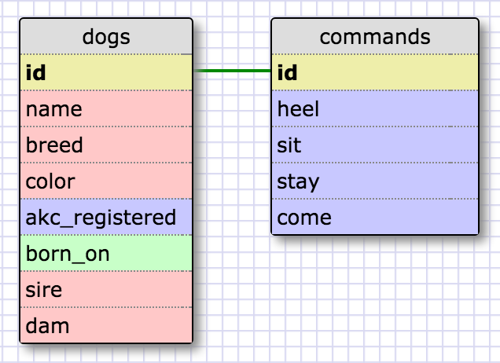
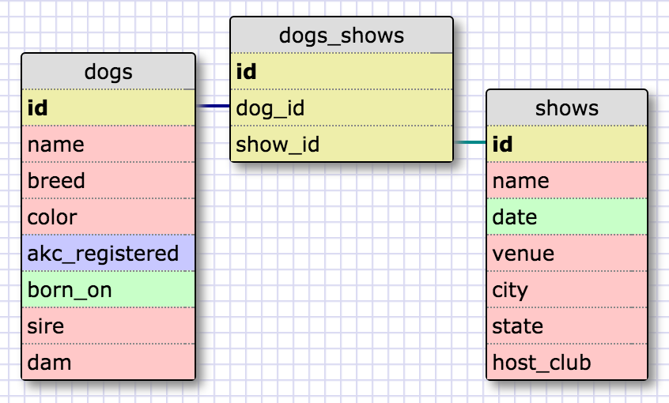
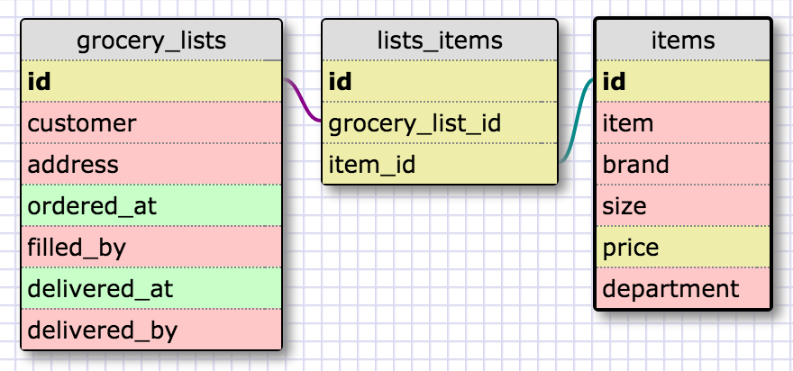

# Challenge 8.5: More Schemas
#### By Jeff George, 10/28/15 for Dev Bootcamp Phase 0

## Release 2: Create a One-to-one Schema

## Release 3: Many to Many Relationships

## Release 4: Refactor

## Release 6: Reflect

#### What is a one-to-one database?

A one-to-one relationship between tables in a database exists when each record in each table is related to one and only one record in the other table. They are connected by a foreign key in the child table, which points to the primary key in the parent table.

#### When would you use a one-to-one database? (Think generally, not in terms of the example you created).

A one-to-one relationship would be appropriate when it would be possible to combine the tables into a single table, but doing so is not desireable. This occurs when the values which belong to the values of the parent table are related closely to one another, but are not _required_ by the child table. Essentially, the parent table holds keys and values that are optional or extra to the child table. For example, if the child table holds "states", the parent table might hold "international_airports". For states that have an international airport, the value the field "intl_airport_id" would point to the primary key (the id) of the record for that state's international airport in the international_airports table (pretend each state can only have one international airport for a moment...), which might hold integer values for the number of flights per day to and from all major foreign countrys. (This value would most likely be set to default to 0, and need to be set with precised data for each country with connections to the state's airport.)

#### What is a many-to-many database?

A many-to-many relationship exists between two tables when any number of records in one table may be related to any number of records in the other table. In order to accomplish this, the two tables are connected through a "join table"&mdash;a third table which includes foreign keys pointing to the prime key of each table. Additional information may included in fields that are relevant if and when a relationship exists between the two tables. For example, in our grocery list example, above, the lists_items table might also include all of the items that have been (or might have been) included on the shopping list as integers, showing quantity ordered, as well as a total cost of the order.

#### When would you use a many-to-many database? (Think generally, not in terms of the example you created).

Many-to-many relationships exist whenever objects or entities in two different categories can be associated with one another in a wide variety of possible combinations, and possibly through mor than one connection at a time. Lists of customers and inventory items, connected through a join table that holds orders, are just one example. A table of sports teams and a table of players could be joined through a join table representing the roster for a game or a season. A table of art objects and a table of galleries could be connected through a join table which lists the objects in a specific exhibition.

#### What is confusing about database schemas? What makes sense?

It's not so much that I am confused about databases and schemas, as that I am aware of how much I don't know about how to use them. How can we connect a SQL database to a website, for example, so that the website can serve items for sale, or information on a broad variety of topics? How can we write new and original queries, and put them to the database, in a live situation? I'm sure these questions will be answered later in DBC, or else we wouldn't have been introduced to databases at all.
